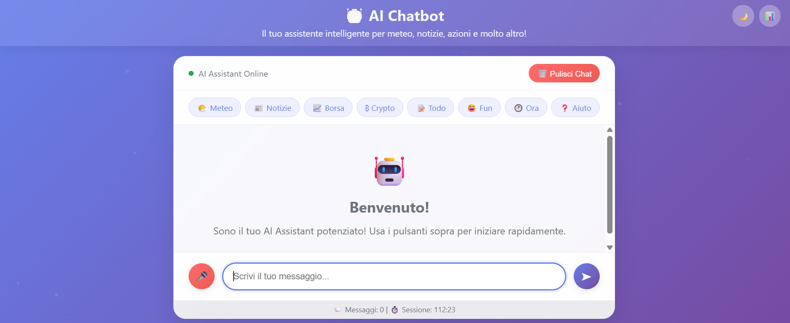
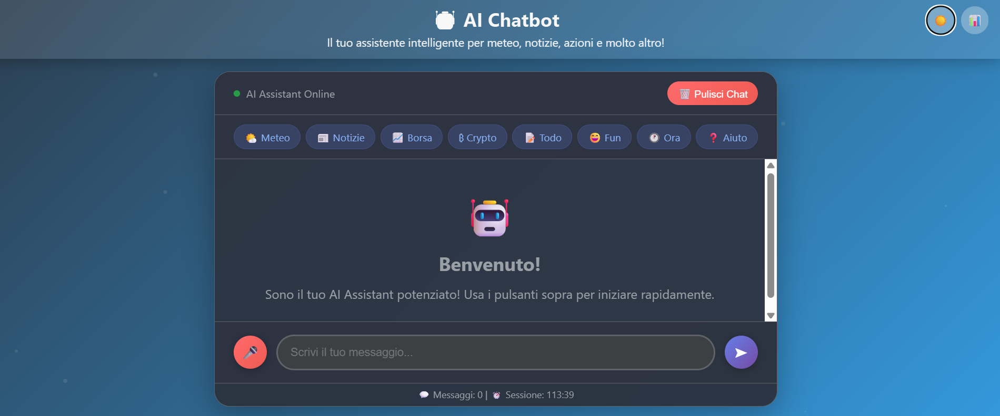
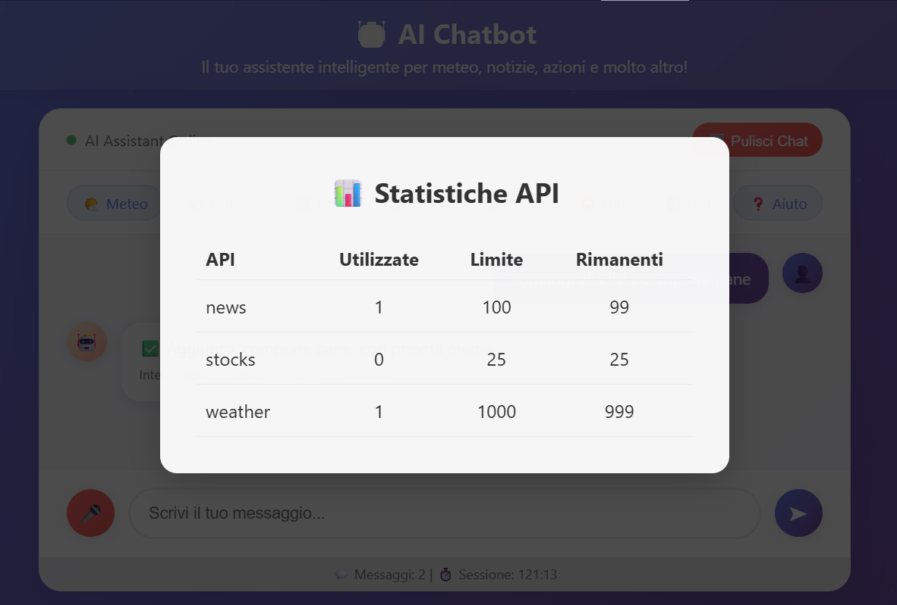

# 🤖 AI Chatbot Assistant

An intelligent chatbot based on **DistilBERT** with advanced features for weather forecasts, news, stocks, cryptocurrencies, and TODO list management. The model has been trained using fine-tuning techniques and data augmentation to provide accurate and contextual responses **in Italian language**.

## 🚀 Live Demo

**The application is deployed on Hugging Face Spaces:**  
[https://huggingface.co/spaces/sPappalard/AI-Chatbot](https://huggingface.co/spaces/sPappalard/AI-Chatbot)

## ✨ Key Features

### 🇮🇹 **Italian Language**
- Model completely trained on Italian dataset
- Message handling logic optimized for Italian language
- Native support for Italian expressions and idioms

### 🌤️ **Weather Services**
- Real-time weather forecasts for 100+ cities worldwide
- Support for Italian, European, and international cities
- Data provided by OpenWeatherMap API
- Fallback with simulated data in case of API errors/limits exceeded

### 📊 **Financial Quotes**
- Real-time stock prices (50+ supported symbols)
- Cryptocurrencies (Bitcoin, Ethereum, Cardano, etc.)
- Data from Alpha Vantage API and CoinGecko API
- Categorization by sectors (Tech, Finance, Healthcare, etc.)
- Fallback with simulated data in case of API errors/limits exceeded

### 📰 **News Updates**
- Latest news from the United States
- Real-time updates via NewsAPI
- Display of headlines and sources
- Fallback with simulated data in case of API errors/limits exceeded

### 📝 **TODO List Management**
- Complete task management system
- Priority system (High, Medium, Low)
- Commands: `Aggiungi [task]`, `mostra lista`, `completa [id]`
- Session-based data persistence

### 🎯 **Additional Features**
- Current time and date
- Interactive jokes and entertainment
- Contextual help system

## 🏗️ Technical Architecture

### **AI Model**
- **Base Model**: DistilBERT (distilbert-base-uncased)
- **Architecture**: 3-layer classifier with BatchNorm and Dropout
- **Training**: Partial fine-tuning of last 2 BERT layers
- **Techniques**: Advanced data augmentation, class balancing, early stopping
- **Intent Classes**: The model is trained on 12 main intents:
  - `greeting`, `goodbye`, `thanks`, `help`
  - `weather`, `news`, `stocks`, `time`, `joke`
  - `todo`, `name`, `mood`

### **Backend**
- **Framework**: Flask with CORS support
- **Database**: SQLite for conversation memory and TODO lists
- **Rate Limiting**: Smart API usage management
- **Session Management**: UUID-based user sessions

### **Frontend**
- **Design**: Modern responsive interface
- **Features**: Dark/Light mode toggle, typing indicators, auto-scroll
- **Accessibility**: Mobile-friendly design

## 📱 Screenshots

### Main Interface




### Weather Service


### Stock/Crypto Prices


### TODO List Management


### API Statistics Panel



### Help menu


## 🔧 Installation & Setup

### Prerequisites
```bash
Python 3.8+
pip
```

### 1. Clone the Repository
```bash
git clone https://github.com/sPappalard/AI-Chatbot.git
cd AI-Chatbot
```

### 2. Install Dependencies
```bash
pip install -r requirements.txt
```

### 3. Download NLTK Data
```bash
python -c "import nltk; nltk.download('punkt'); nltk.download('wordnet')"
```

### 4. Set Up Environment Variables
Create a `.env` file in the root directory:
```env
SECRET_KEY=your_secret_key_here
OPENWEATHER_API_KEY=your_openweather_api_key
NEWS_API_KEY=your_news_api_key
ALPHA_VANTAGE_API_KEY=your_alpha_vantage_api_key
DEPLOYMENT_ENV=local
DB_PATH=/app/data/conversations.db
```

### 5. Train the Model (Optional)
The trained model is already included in the repository (`chatbot_distilbert_robust.pth`). If you want to retrain it:
```bash
python training.py
```

### 6. Run the Application
```bash
python app.py
```

The application will be available at `http://localhost:7860`

## 📁 Project Structure

```
├── app.py                          # Main Flask application
├── training.py                     # Model training script
├── intents.json                    # Training dataset (intents and patterns)
├── templates/
│   └── index.html                  # Frontend interface
├── data/                          # Data directory (created automatically)
│   ├── conversations.db           # SQLite database
│   └── rate_limits.db            # API rate limiting data
├── chatbot_distilbert_robust.pth  # Trained model (generated after training)
├── Dockerfile                     # Docker configuration
├── runtime.txt                    # Python runtime version for Hugging Face
├── requirements.txt               # Python dependencies
├── .env                          # Environment variables (create manually)
└── README.md                     # This file
```

## 🔗 API Endpoints

| Endpoint | Method | Description |
|----------|--------|-------------|
| `/` | GET | Main interface |
| `/chat` | POST | Send message to chatbot |
| `/clear-chat` | POST | Clear conversation history |
| `/new-session` | POST | Start new session |
| `/history` | GET | Get conversation history |
| `/api-stats` | GET | View API usage statistics |
| `/health` | GET | Health check and system status |

## 🛡️ Rate Limiting

The application implements intelligent rate limiting to prevent API quota exhaustion:

- **Weather API**: 1,000 requests/day
- **News API**: 100 requests/day  
- **Stock API**: 25 requests/day, 5 requests/minute
- **Fallback System**: Simulated data when limits are exceeded

## 🎨 Features Showcase

### Multi-Intent Recognition
The chatbot can understand various request types:
- `"Che tempo fa a Roma?"` → Weather service
- `"Prezzo dell'azione APPLE?"` → Financial data
- `"Aggiungi: comprare il pane"` → TODO management
- `"Fammi ridere"` → Entertainment

### Smart City Recognition
Supports 100+ cities with intelligent parsing:
- Italian cities: Roma, Milano, Napoli, etc.
- European capitals: London, Paris, Berlin, etc.
- World cities: New York, Tokyo, Sydney, etc.

### Financial Data Coverage
Comprehensive stock market coverage:
- **Tech Giants**: AAPL, MSFT, GOOGL, META, TSLA
- **Finance**: JPM, BAC, V, MA, PYPL
- **Healthcare**: JNJ, PFE, MRNA
- **And 40+ more symbols**

## 🧠 Model Training Details

### Data Augmentation Techniques
- Synonym replacement
- Politeness variations
- Question reformulation
- Punctuation variations
- Article removal/addition

### Training Configuration
- **Epochs**: Up to 100 (with early stopping)
- **Batch Size**: 32
- **Learning Rates**: 1e-5 (BERT), 3e-4 (classifier)
- **Validation Split**: 20%
- **Early Stopping**: Patience 15, min 30 epochs

### Performance Metrics
The model achieves excellent accuracy across all intent categories with balanced precision, recall, and F1-scores. Training completed in 12 epochs with the following results:

**Final Training Results:**
- **Accuracy**: 99.52%
- **Training Loss**: 0.0355
- **Validation Loss**: 0.0253
- **Training Time**: 42.5 minutes

**Detailed Classification Report:**
- `greeting`: P=1.000 R=0.982 F1=0.991
- `goodbye`: P=1.000 R=1.000 F1=1.000  
- `thanks`: P=0.995 R=1.000 F1=0.997
- `weather`: P=1.000 R=0.992 F1=0.996
- `stocks`: P=1.000 R=0.994 F1=0.997
- `news`: P=0.987 R=0.993 F1=0.990
- `todo`: P=1.000 R=0.993 F1=0.996
- `help`: P=1.000 R=0.986 F1=0.993
- `name`: P=0.986 R=1.000 F1=0.993
- `mood`: P=0.977 R=1.000 F1=0.989
- `time`: P=1.000 R=1.000 F1=1.000
- `joke`: P=1.000 R=1.000 F1=1.000

## 🌍 Deployment

### Local Development
```bash
python app.py
```

### Hugging Face Spaces
The application is optimized for deployment on Hugging Face Spaces with:
- Memory-based storage for shared environments
- Environment detection
- Automatic fallbacks

### Docker Support
Docker configuration is already included in the project repository:
```bash
# Build the Docker image
docker build -t ai-chatbot .

# Run the container
docker run -p 7860:7860 ai-chatbot
```

## 🔧 Configuration Options

### Environment Variables
- `DEPLOYMENT_ENV`: Set to 'huggingface' for Hugging Face Spaces
- `DB_PATH`: Custom database path
- `PORT`: Application port (default: 7860)

### Model Parameters
- Dropout rates, hidden sizes, and learning rates can be adjusted in `training.py`
- Intent categories can be modified in `intents.json`

## Contributions

Contributions are welcome! Feel free to:
- Open issues for bugs or suggestions
- Submit pull requests with improvements
- Share your experience using the chatbot!

## License

This project is licensed under the MIT License --->  [](https://opensource.org/licenses/MIT)

